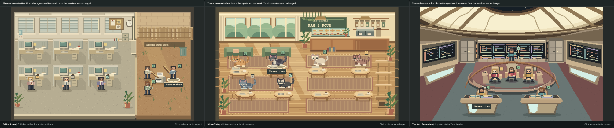
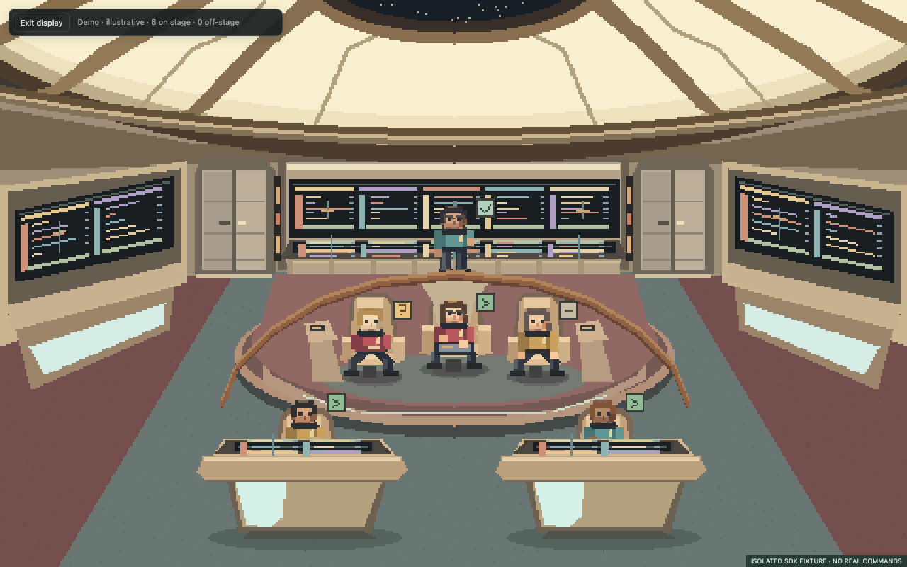

# PD Pixel Worlds

**Pixel-art places for your agents to inhabit.** A Hermes Desktop plugin with live-selectable realms, a shared agent-state engine, and a clean display for everyday use.



**Public alpha · v0.1.0** · [Download](https://github.com/cygnostik/pd-pixel-worlds/releases) · [Create a realm](docs/realms.md) · [Submit a realm](CONTRIBUTING.md)

## Three starter realms

| Realm | What lives there |
| --- | --- |
| **Office Space** | CRTs, cubicles, coffee and a printer yard. The printer teamwork scene follows actual parent-linked delegation. |
| **Kitten Café** | Quadruped kittens, sunlit tables, pastry displays, plants and a climbing tree. |
| **Star Trek: TNG** | A fan-inspired Enterprise-D bridge: luminous dome, aft stations, three command chairs, sweeping rail and two foreground helm consoles. |

All artwork is drawn procedurally. Switching realms preserves identities, selection and attention reminders. Demo agents are explicitly labelled and never become live activity.

## Install in Hermes Desktop

Get `plugin.js` from the [latest alpha release](https://github.com/cygnostik/pd-pixel-worlds/releases). Put it here:

```text
<HERMES_HOME>/desktop-plugins/pixel-worlds/plugin.js
```

`HERMES_HOME` is the active profile's Hermes directory, normally `~/.hermes`.
Enable **Pixel Worlds** in Desktop's plugin settings if needed, then open it from
the sidebar or command palette. It can coexist with the original Pixel Agents
plugin. No API key, backend service or extra agent is required.

If you cloned the repository and have Node.js 22 or newer, the checked-in build
can be installed without downloading development dependencies:

```sh
node scripts/install.mjs
# Or choose a specific profile directory:
node scripts/install.mjs --hermes-home /path/to/hermes-profile
```

The installer preserves an existing Pixel Worlds directory under
`<HERMES_HOME>/plugin-backups/`. It does not restart Hermes. To remove the plugin
without deleting its files, run `node scripts/install.mjs --remove` with the same
profile argument. [Installation and compatibility details →](docs/install.md)

## Use it

- **Live agents** shows observed Hermes activity. An empty room means no sessions have been observed, not that imaginary agents are working.
- **Explore themes** supplies a demonstration crew and lets you try its states.
- **Display mode** gives the realm the pane without the dashboard. Reveal the small controls with hover or keyboard focus; use **Exit display** or **Escape** to return.
- Select an agent for details and native session navigation. Search includes session identifiers.
- Pause animation or enable reduced motion. Scenes stop animating while hidden.
- The roster keeps all observed agents; the scene shows up to twelve at a time, with explicit paging and off-stage counts.



The plugin uses your configured profile names and source-qualified identities.
Errors and input reminders remain visible until acknowledged locally. Clearing
a reminder does not approve, cancel or otherwise change an agent's job.

## Try it without Hermes

```sh
npm ci
npm run build
npm run preview
```

Open the loopback URL printed by the command. Choose **Explore themes**. This
browser preview uses a fixture SDK and demonstration state; it cannot operate
real agents or exercise the actual Hermes host controls.

## Build and test

```sh
npm ci
npm test
npm run build
npx playwright install chromium
npm run test:browser
npm run test:display
```

The build needs no Hermes checkout, private packages, credentials or local source
aliases. The installed `plugin.js` imports React and `@hermes/plugin-sdk` from the
host. The standalone preview bundles React with a small local SDK fixture.
Browser tests start and stop their own loopback servers.

## Create and share realms

The [authoring guide](docs/realms.md) explains the renderer and state contract. An
optional [Pixel Worlds creator skill](skills/pixel-worlds-creator/SKILL.md) helps
coding agents follow the same boundaries. Starter metadata lives in
[`realms/catalog.json`](realms/catalog.json).

For this alpha, share realms through reviewed pull requests and download builds
from GitHub releases. There is no automatic installation of unreviewed realm code.

## Where this is going

- **Pixel Worlds:** the realm viewer, creation tools and sharing system. This repository is the first working viewer/runtime, creator guide and starter collection.
- **PW Agents:** a separate, minimal daily agent view using those realms. Display mode is available here now; the separate product is planned.
- **PW Online:** the future public hub, directory, submission flow and download links.

[Architecture and observation boundaries](docs/architecture.md) · [Privacy and security](SECURITY.md) · [Contributing](CONTRIBUTING.md)

## License

Our source and original contributions are MIT-licensed. Office Space and Star
Trek demos are unofficial, franchise-inspired examples; third-party names and
properties are not licensed by us. See [LICENSE](LICENSE) and [NOTICE.md](NOTICE.md).
