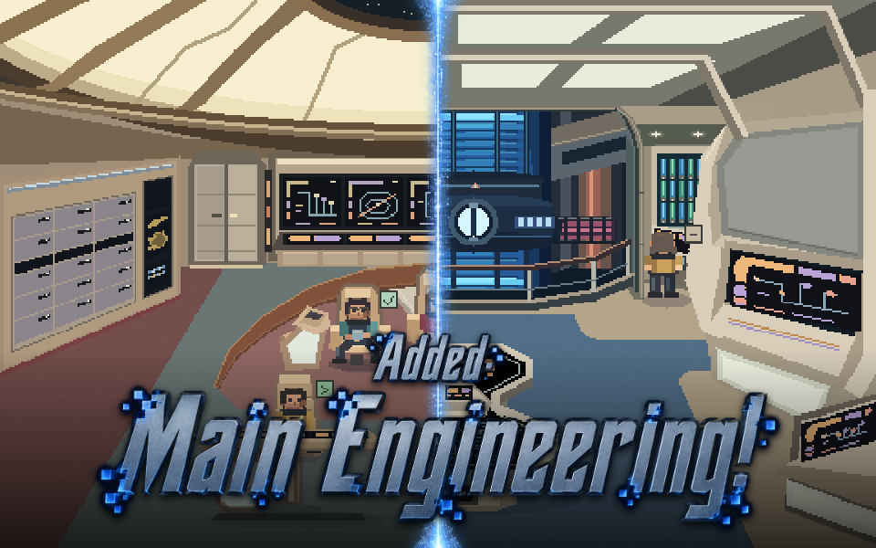
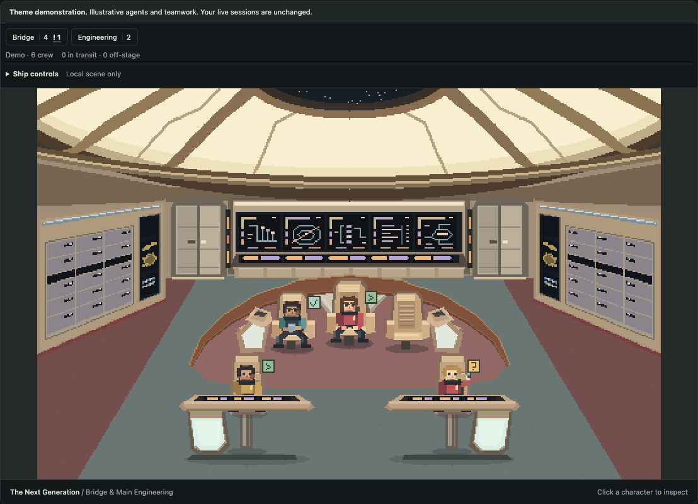
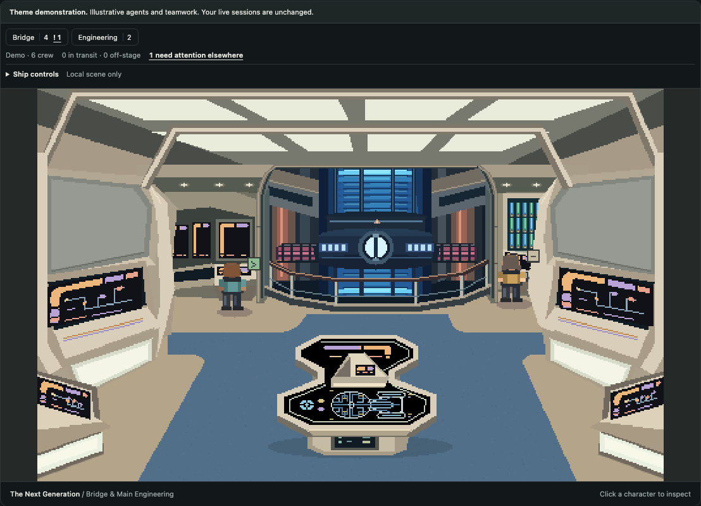
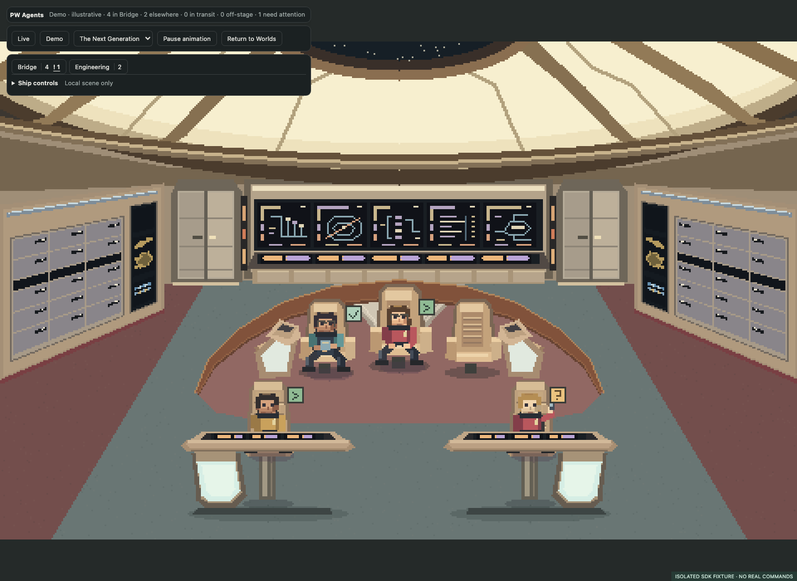

# PD Pixel Worlds

**Pixel-art places for your agents to inhabit.** A Hermes Desktop plugin with live-selectable realms, a shared agent-state engine, and a clean display for everyday use.


**Public alpha · v0.2.0** · **[Browse & download realms](realms/README.md)** · [Get the plugin](https://github.com/cygnostik/pd-pixel-worlds/releases) · [Create a realm](docs/realms.md) · [Submit a realm](https://github.com/cygnostik/pd-pixel-worlds/issues/new?template=realm-submission.yml)

[](https://github.com/cygnostik/pd-pixel-worlds/actions/workflows/ci.yml) · [Install](#install-in-hermes-desktop) · [Use it](#use-it) · [Create a realm](#create-and-share-realms) · [MIT](LICENSE)

## Three starter realms

**Main-branch candidate, not yet released:** this checkout adds stronger LCARS
panels and a built-in TNG ship with Bridge and Main Engineering. Use the room
buttons and **Ship controls** for night shift, core/diagnostic effects and local
crew placement. The chief engineer's office artwork is retained in source but
is not available in this release candidate. Scene buttons use the same compact,
neutral styling as the other world controls. They do not run commands or route
real jobs. The published v0.2.0 download
does not include this candidate yet.

*Screenshots show the current main-branch build with demonstration agents, not live sessions.*

| Realm | What lives there |
| --- | --- |
| **Office Space** | CRTs, cubicles, coffee and a printer yard. The printer teamwork scene follows actual parent-linked delegation. |
| **Kitten Café** | Quadruped kittens, sunlit tables, pastry displays, plants and a climbing tree. |
| **Star Trek: TNG** | A fan-inspired Enterprise-D bridge: luminous dome, aft stations, three command chairs, sweeping rail and two foreground helm consoles. |

The starter artwork is drawn procedurally. Switching realms preserves identities, selection and attention reminders. Demo agents are explicitly labelled and never become live activity.

### Two rooms. One crew.



The current TNG world connects the Bridge and Main Engineering. Crew placement,
room counts and attention indicators stay shared when you switch views.

| Bridge | Main Engineering |
| --- | --- |
|  |  |

## Add a realm

1. Pick a scene in the **[realm gallery](realms/README.md)** and download its `.pwrealm.json` package.
2. Open **Pixel Worlds → Import realm** and select the file.
3. Select it in Pixel Worlds or **PW Agents**. No rebuild or restart is needed.

Imported realms stay in your local library across restarts. A package contains
embedded PNG scenery, station positions and a supported character style—not
executable plugin code. [Package format and creator guide →](docs/realms.md)

## Install in Hermes Desktop

Get `plugin.js` from the [latest alpha release](https://github.com/cygnostik/pd-pixel-worlds/releases). Put it here:

```text
<HERMES_HOME>/desktop-plugins/pixel-worlds/plugin.js
```

`HERMES_HOME` is the active profile's Hermes directory, normally `~/.hermes`.
Enable **Pixel Worlds** in Desktop's plugin settings if needed, then open it from
the sidebar or command palette. It can coexist with the original Pixel Agents
plugin. No API key, backend service or extra agent is required.

If you cloned the repository and have Node.js 22 or newer, the checked-in build
can be installed without downloading development dependencies:

```sh
node scripts/install.mjs
# Or choose a specific profile directory:
node scripts/install.mjs --hermes-home /path/to/hermes-profile
```

The installer preserves an existing Pixel Worlds directory under
`<HERMES_HOME>/plugin-backups/`. It does not restart Hermes. To remove the plugin
without deleting its files, run `node scripts/install.mjs --remove` with the same
profile argument. [Installation and compatibility details →](docs/install.md)

## Use it

- **Live agents** shows observed Hermes activity. An empty room means no sessions have been observed, not that imaginary agents are working.
- **Explore themes** supplies a demonstration crew and lets you try its states.
- **PW Agents** opens the uncluttered daily display directly from the sidebar or command palette. It shares the same live state and imported realms as Pixel Worlds.
- **Display mode** gives the realm the pane without the dashboard. Reveal the small controls with hover or keyboard focus; use **Exit display** or **Escape** to return.
- Select an agent for details and native session navigation. Search includes session identifiers.
- Pause animation or enable reduced motion. Scenes stop animating while hidden.
- The roster keeps all observed agents. Office/café and imports use twelve-person scene pages; the candidate TNG ship has seven Bridge and eight Engineering stations, with separate elsewhere/transit/off-stage counts.



The plugin uses your configured profile names and source-qualified identities.
Errors and input reminders remain visible until acknowledged locally. Clearing
a reminder does not approve, cancel or otherwise change an agent's job.

## Try it without Hermes

```sh
npm ci
npm run build
npm run preview
```

Open the loopback URL printed by the command. Choose **Explore themes**. This
browser preview uses a fixture SDK and demonstration state; it cannot operate
real agents or exercise the actual Hermes host controls.

## Build and test

```sh
npm ci
npm test
npm run build
npx playwright install chromium
npm run test:browser
npm run test:display
npm run test:realms
npm run test:ship
```

The build needs no Hermes checkout, private packages, credentials or local source
aliases. The installed `plugin.js` imports React and `@hermes/plugin-sdk` from the
host. The standalone preview bundles React with a small local SDK fixture.
Browser tests start and stop their own loopback servers.

To refresh the repository graphics from the current build:

```sh
npm run build
node scripts/capture-repo-media.mjs
```

The capture uses the isolated browser preview and its demonstration crew. It
refreshes the scene screenshots, README hero, catalog banner and social card
without connecting to Hermes or reading live sessions. [Media details →](docs/media.md)

## Create and share realms

The [realm gallery](realms/README.md) is the collection's home: screenshots,
author credits and direct downloads. The [authoring guide](docs/realms.md) and
[creator skill](skills/pixel-worlds-creator/SKILL.md) cover making packages and
testing them in both views. Machine-readable metadata lives in
[`realms/catalog.json`](realms/catalog.json).

Use the [realm submission form](https://github.com/cygnostik/pd-pixel-worlds/issues/new?template=realm-submission.yml)
to propose a listing, or send a pull request. Directory submissions are reviewed;
downloads never execute a realm's own scripts.

## Where this is going

- **Pixel Worlds:** the viewer, local realm library, import flow and creator skills.
- **PW Agents:** the separate minimal daily-use view, included in this plugin and sharing its runtime.
- **PW Online:** the future dedicated website. The repository gallery, downloads and submission form serve as the hub now.

[Architecture and observation boundaries](docs/architecture.md) · [Privacy and security](SECURITY.md) · [Contributing](CONTRIBUTING.md)

## License

Our source and original contributions are MIT-licensed. Office Space and Star
Trek demos are unofficial, franchise-inspired examples; third-party names and
properties are not licensed by us. See [LICENSE](LICENSE) and [NOTICE.md](NOTICE.md).
