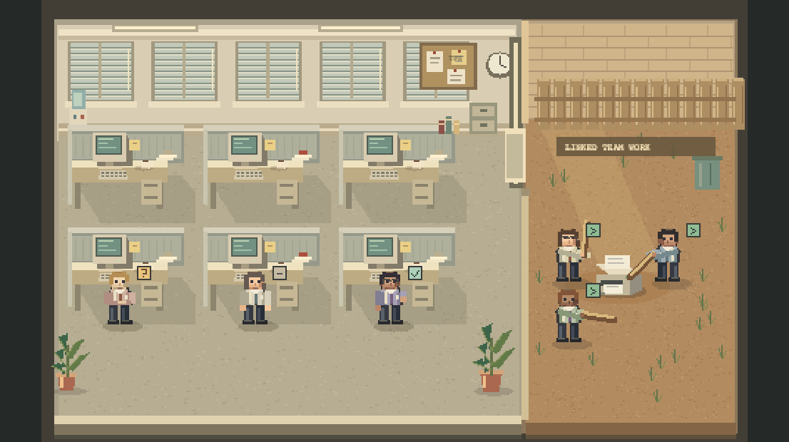
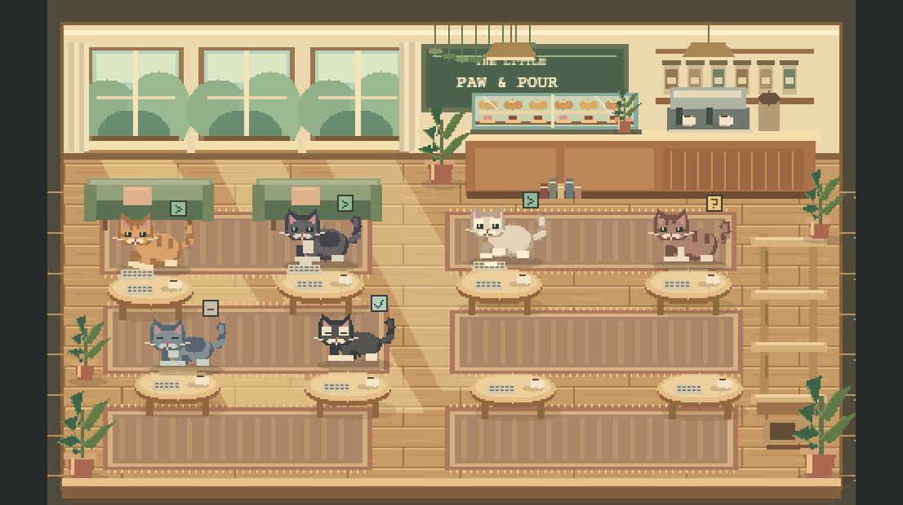
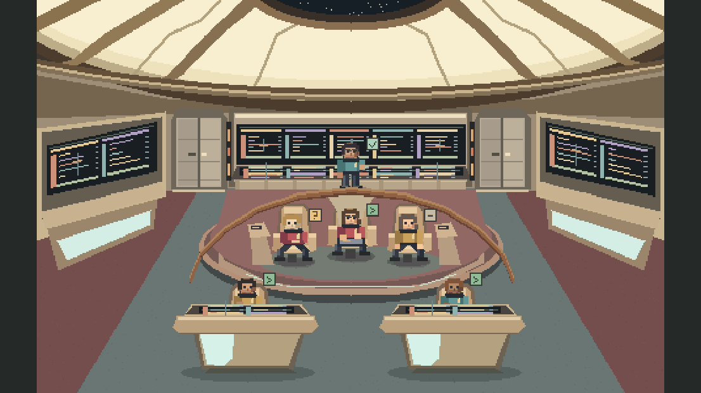

# Browse realms

Download a realm, then open **Pixel Worlds → Import realm** and choose its
`.pwrealm.json` file. It becomes available in both **Pixel Worlds** and **PW Agents**
without rebuilding or restarting Hermes.

[Get Pixel Worlds](https://github.com/cygnostik/pd-pixel-worlds/releases) · [Submit a realm](https://github.com/cygnostik/pd-pixel-worlds/issues/new?template=realm-submission.yml) · [Create one](../docs/realms.md)

## Starter collection

### Office Space

Beige cubicles, CRTs, coffee and a printer yard. The built-in office uses real
parent-linked teamwork for its printer scene; imported packages provide the
scenery and supported character style rather than new executable behaviors.

**By ProDyn · Original procedural artwork · Unofficial film-inspired demo**

[Download Office Space](https://github.com/cygnostik/pd-pixel-worlds/releases/download/v0.2.0/pd-office-space.pwrealm.json) · [Package source](pd-office-space.pwrealm.json)

### Kitten Café

A sunlit café with expressive kittens, pastry displays, plants and climbing furniture.

**By ProDyn · Original setting and artwork · MIT**

[Download Kitten Café](https://github.com/cygnostik/pd-pixel-worlds/releases/download/v0.2.0/pd-kitten-cafe.pwrealm.json) · [Package source](pd-kitten-cafe.pwrealm.json)

### Star Trek: TNG

An aft-facing Enterprise-D-inspired bridge, with the luminous dome, three command
chairs, sweeping rail and two foreground helm stations.

**By ProDyn · Original procedural artwork · Unofficial franchise-inspired demo**

[Download TNG bridge](https://github.com/cygnostik/pd-pixel-worlds/releases/download/v0.2.0/pd-tng-bridge.pwrealm.json) · [Package source](pd-tng-bridge.pwrealm.json)

See [NOTICE.md](../NOTICE.md) for third-party names and property rights. The MIT
license does not grant franchise or trademark rights.

## Community realms

[Submit your realm](https://github.com/cygnostik/pd-pixel-worlds/issues/new?template=realm-submission.yml)
with a screenshot, downloadable package, author credit and asset license. Reviewed
submissions can join this directory. The submission form is not automatic approval.

Realm packages are data: embedded PNG artwork, station positions and a supported
character style. They cannot contain executable JavaScript, CSS, HTML, SVG or
external asset URLs. The importer validates the package before adding it to your
local library. It does not replace plugin code or bypass Hermes updates.

The built-in starter scenes stay available even if you remove their imported copies.
